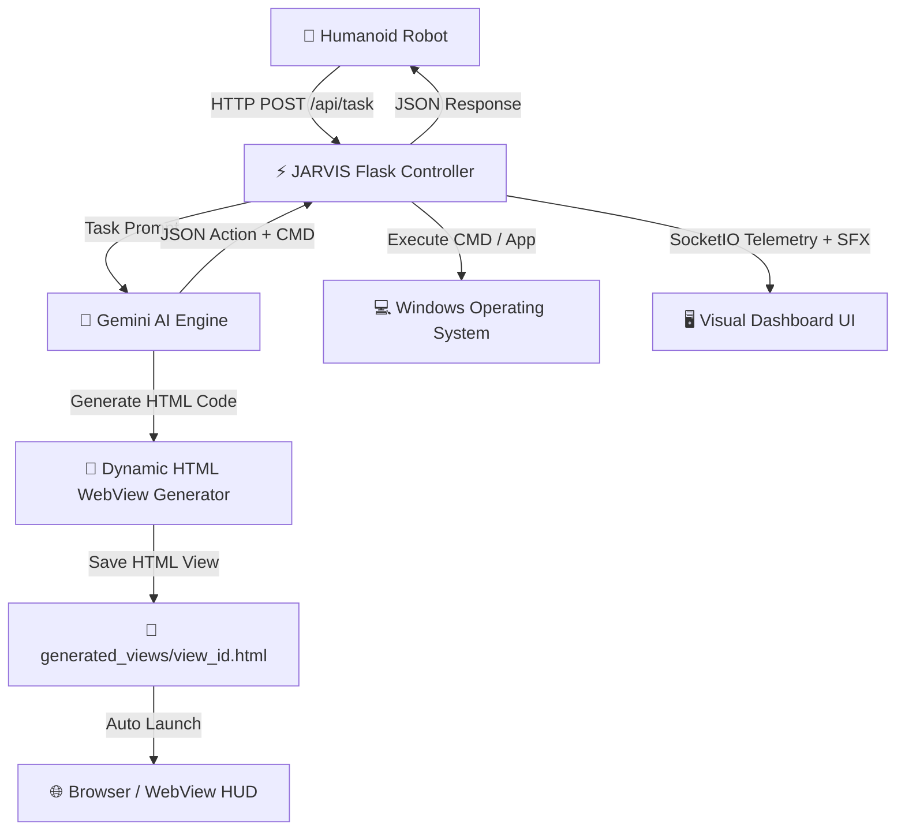

# 🤖 JARVIS — Humanoid Robot & Voice AI Controller Engine

**JARVIS** — O'zbek tilidagi aqlli **Gumanoid Robot Boshqaruv Servisi** va **Ovozli Yordamchi**. Ushbu tizim mahalliy (local) portda HTTP REST API orqali gumanoid robotlar bilan bog'lanadi, Gemini AI yordamida buyruqlarni tahlil qiladi, Windows CMD/PowerShell buyruqlarini bajaradi, orqa fonda **Dinamik HTML WebView** sahifalarini generate qiladi hamda klaviatura chertilish ovozi (`tq-tq-tq`) hamrohligida chiroyli vizual kartalarda natijalarni taqdim etadi.

---

## 📐 System Architecture (Tizim Arxitekturasi)



---

## 🌟 Key Features (Asosiy Imkoniyatlar)

1. **🤖 Gumanoid Robot REST API:** Local network (`http://127.0.0.1:5000` yoki LAN IP) orqali gumanoid robotdan so'rovlarni ovozsiz (silent/headless) qabul qilish.
2. **🎨 Dynamic AI HTML WebView Generator:** Gemini AI har bir topshiriq uchun orqa fonda zamonaviy Cyberpunk HTML/CSS/JS vizual sahifalarini yaratadi va brauzerda avtomatik ochadi.
3. **⌨️ Mechanical Typing SFX ("Tq-Tq-Tq"):** AI kodi va buyruqlar yozilayotganda orqa fonda mexanik klaviatura ovoz effekti o'ynaydi.
4. **📊 Visual Action Cards:** Quruq konsol loglari o'rniga foydalanuvchi va robotga tushunarli Vizual Kartalar ko'rsatiladi.
5. **🎤 Voice & Silent Dual Mode:** Ovozli muloqot hamda gumanoid robot uchun ovozsiz avtomatlashtirilgan rejim.

---

## 🚀 Installation & Quick Start (Ishga Tushirish)

### 1. API Kalitini O'rnatish

```bash
# Windows PowerShell:
$env:GEMINI_API_KEY="Sizning_Gemini_API_Kalitingiz"

# Windows CMD:
set GEMINI_API_KEY=Sizning_Gemini_API_Kalitingiz
```

### 2. Bog'liqliklarni O'rnatish

```bash
pip install -r requirements.txt
```

### 3. Servisni Ishga Tushirish

```bash
python app.py
```

- **Veb Boshqaruv Markazi:** `http://127.0.0.1:5000`
- **Robot REST API Endpoint:** `http://127.0.0.1:5000/api/task`

---

## 📡 Humanoid Robot Integration Guide (Robotni Ulash Qo'llanmasi)

### 1. Python orqali so'rov yuborish

```python
import requests

url = "http://127.0.0.1:5000/api/task"
payload = {
    "task": "Chrome brauzerini ochib robotehnika bo'yicha izla va vizual UI yarat",
    "robot_id": "humanoid_01",
    "silent": True,
    "generate_ui": True
}

response = requests.post(url, json=payload)
print(response.json())
```

### 2. cURL orqali so'rov yuborish

```bash
curl -X POST http://127.0.0.1:5000/api/task \
  -H "Content-Type: application/json" \
  -d '{"task": "Telegramni och", "robot_id": "humanoid_01", "silent": true}'
```

### 3. Response JSON Formati

```json
{
  "status": "success",
  "robot_id": "humanoid_01",
  "task": "Chrome brauzerini ochib robotehnika bo'yicha izla",
  "ai_response": "Chrome ochilib, robotehnika qidirilmoqda!",
  "command_executed": "start \"\" \"https://www.google.com/search?q=robotehnika\"",
  "command_type": "url",
  "generated_view_url": "http://127.0.0.1:5000/view/view_1723425123",
  "execution_time_ms": 380,
  "timestamp": 1723425123
}
```

---

## 📜 Full User Guide

To'liq foydalanuvchi va robot qo'llanmasi uchun **[USER_GUIDE.md](USER_GUIDE.md)** fayliga qarang.
